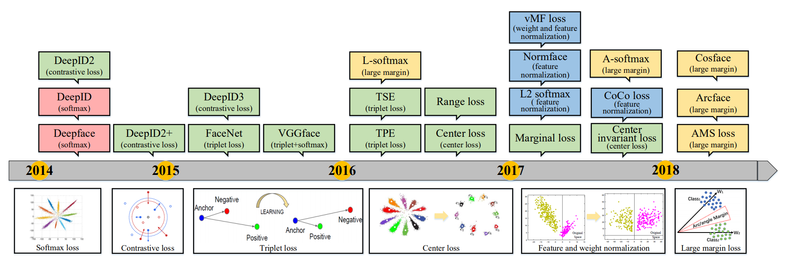
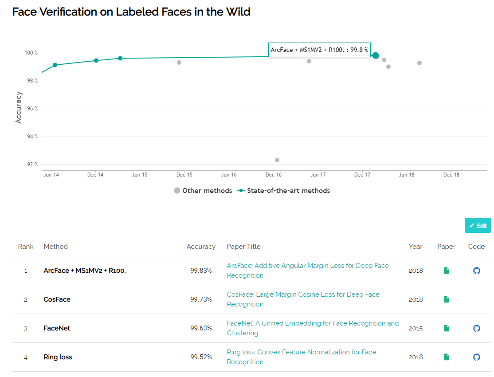

# face-recognition
_ Face Verification과 Identification을 모두 아우르는 얼굴 인식 기술에 대한 기술 동향_

> ref: Mei Wang and Weihong Deng, "Deep Face Recognition: A Survey," 2018

## Contents
- [Survey](mds/survey.md)
- [논문 리뷰](#논문-리뷰)
  - [Mei Wang and Weihong Deng, "Deep Face Recognition: A Survey," CoRR, 2018](papers/Deep_Face_Recognition_A_Survey.md)
- [Pre-trained Model](#pre-trained-model)
- [Source Code](#code)
- [Dataset](#dataset)
- [Links](#links)

## 논문 리뷰
- [Mei Wang and Weihong Deng, "Deep Face Recognition: A Survey," 2018](papers/Deep_Face_Recognition_A_Survey.md)

## Pre-Trained Model
- Tensorflow
    - [Inception ResNet v1(CASIA-WebFace)](https://github.com/davidsandberg/facenet)
    - [Inception ResNet v1(VGGFace2)](https://github.com/davidsandberg/facenet)
Keras
    - [krasserm's openFace](http://krasserm.github.io/2018/02/07/deep-face-recognition/)
    - [iwantooxxoox' openFace](https://github.com/iwantooxxoox/Keras-OpenFace)
    - [oxford's VGGface](https://github.com/rcmalli/keras-vggface)

## Code
- Keras
    - [krasserm's openFace](http://krasserm.github.io/2018/02/07/deep-face-recognition/)
    - [iwantooxxoox's openFace](https://github.com/iwantooxxoox/Keras-OpenFace)

## Dataset
- [InsightFace Git의 Dataset Zoo](https://github.com/deepinsight/insightface/wiki/Dataset-Zoo) - 잘 정리되어있음
    - CASIA-Webface, UMDFace, VGG2, MS1M-IBUG, MS1M-ArcFace, Asian-Celeb, DeepGlint
- [The Asian Face Age Dataset (AFAD)](http://afad-dataset.github.io/)
- [Trillionpairs](http://trillionpairs.deepglint.com/overview)
    - [google drive](https://drive.google.com/drive/folders/1ADcZugpo8Z6o5q1p2tIAibwhsL8DcVwH)
    
## Links
- [딥러닝을 이용한 셀럽 얼굴 인식 by kakao](https://mk.kakaocdn.net/dn/if-kakao/conf2018/deep_face_recognition.pdf)
- 얼굴 인식에 관한 facebook 글(http://fbsight.com/t/topic/148992)

## Face Recognition 서베이

> ref: https://paperswithcode.com/

> ref: https://paperswithcode.com/

2014 CVPR에서 대표적인 두 모델(DeepFace, DeepID)이 소개되면서 딥러닝 기법으로 활발히 연구가 시작된, 얼굴 인식 분야에 대해 최근 5년간의 동향을 다루고자 합니다.

1. DeepFace (CVPR/2014)
    - Training Set: 4.4M 
    - CNN Layers
    - LFW 97.35%
    - 3D Alignment
    - Ensembel Model
    - Softmax
    - ref:
2. DeepID (CVPR/2014)
    - Training Set: 20W
    - CNN Layers
    - Softmax, Bayseian
    - LWF 97.45%
    - Softmax의 장점과 단점
      - Softmax는, Soft를 최대값으로 하는 것이 목표인 분류기입니다. CNN 분류 문제에서 매우 핫한 존재죠. 4가지를 분류한다고 가정하면, (x1, x2, x3, x4)의 값이 softmax 분류기에 의해 출력됩니다. 이것은 일반적으로 백분율 형태로 계산되고, 가장 큰 출력 값이 예상하는 값/결과가 됩니다.
      - Hard max vs Softmax
      - fig1~3
    - ref: [Deep Learning Face Representation by Joint Identification-Verification](https://papers.nips.cc/paper/5416-deep-learning-face-representation-by-joint-identification-verification)
    - fig4
3. FaceNet (CVPR/2015)
    - Softmax 대신 Triple Loss 사용
      - Triplet loss는 (a, p, n)의 triple 형태로 최적화합니다. 서로 다른(negative)의 특징의 L2거리가 유사한(positive) 특징의 L2 거리보다 크고, 클래스 간 간소화 및 클래스간 분리가 수행됨.
        - a: anchor
        - p: positive
        - n: negative
    - LFW: 99.64%
    - Training Set: 200M 
    - use only 128 dim feature mapping
    - traiplet을 구현하는 코드는 매우 까다롭고 어려움
    - [paper](https://arxiv.org/pdf/1503.03832.pdf)
    - [개념](https://kangbk0120.github.io/articles/2018-01/face-net)
    - [triplet-loss](https://omoindrot.github.io/triplet-loss)
    
4. Large Margin Softmax Loss (ICML/2016)
    - L-softmax는 Large Margin을 가진 softmax이다. 
    - 큰 마진을 만드는 방법
      = United Fully Conntected Layer + Softmax + Cross Entropy
    - Training Set: 0.49M
    - 17 CNN Layers
    - LFW: 98.72%
5. sphereFace (CVPR/2017)
    - L-softmax를 개선하여 A-Softmax 제안
    - training sample 불균형의 수가 감소
    - mapping된 feature vector 각도의 최적화에 집중
    - Training Set: 0.49M
    - 64 CNN Layers
    - LFW: 99.42%
    - (현재 additive margin 시리즈를 훈련하는 것이 간단하고 성능도 더 좋음)
6. Center Loss (ECCV/2016)
    - 카테고리에 대응하는 모든 feature vector에 대해 각 카테고리의 중심을 중앙으로 당김.
    - LFW(w/7 CNN Layers): 99.05
    - LFW(w/64 CNN Layers): 99.28
    - 다수의 클래스 센터를 유지하려면 메모리 소비가 비교적 큼.
7. Center Invariant Loss (ACM MM/2017)
8. Range Loss (ICCV/2017)
9. Ring Loss (CVPR/2018)
10. COCO | Congenerous Cosin (CVPR/2017)
11. L2-constrained Softmax Loss (Arxiv/2017)
12. NormFace (ACM MM/2017)
    - L2 HyperSphere Embedding
13. AM-softmax (ICLR/2018)
    - Additive Margin Softmax
14. CosFace (CVPR/2018)
15. ArcFace (arXiv)
    - ref: https://arxiv.org/abs/1801.07698
    - code(MXNET): https://github.com/deepinsight/insightface
16. InsightFace ()
    - code(tensorflow): https://github.com/auroua/InsightFace_TF
